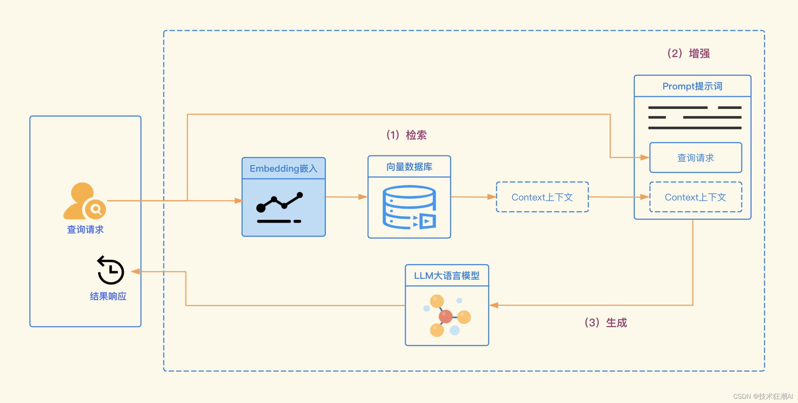
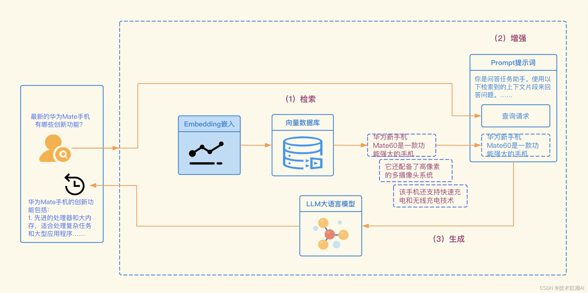

# 基于LangChain的智能检索

## 什么是检索增强生成

​	检索增强生成 (RAG) 是一种使用来自私有或专有数据源的信息来辅助文本生成的技术。它将检索模型（设计用于搜索大型数据集或知识库）和生成模型（例如大型语言模型 (LLM)，此类模型会使用检索到的信息生成可供阅读的文本回复）结合在一起。

​	通过从更多数据源添加背景信息，以及通过训练来补充 LLM 的原始知识库，检索增强生成能够提高搜索体验的相关性。这能够改善大型语言模型的输出，但又无需重新训练模型。额外信息源的范围很广，从训练 LLM 时并未用到的互联网上的新信息，到专有商业背景信息，或者属于企业的机密内部文档，都会包含在内。

​	RAG 对于诸如回答问题和内容生成等任务，具有极大价值，因为它能支持生成式 AI 系统使用外部信息源生成更准确且更符合语境的回答。它会实施搜索检索方法（通常是语义搜索或混合搜索）来回应用户的意图并提供更相关的结果。

​	但问题在于，尽管最先进的LLM经过大量数据训练，拥有广泛的常识性知识，但在需要生成训练数据之外的知识时，如最新、专有或特定领域信息时，LLM可能会出现不准确的情况。以下就是一个典型的例子：

```python
问题：最新的华为Mate手机有哪些创新功能？
 
回答：抱歉，但我无法访问实时信息，我的知识只更新到2023年初。因此，如果华为Mate系列手机在那之后发布了新的型号或功能，我将无法为您提供具体信息。为了获取最新信息，我建议您查看最新的新闻资源或华为的官方声明。
```

​	因此，如何将LLM的常识与其他背景知识有效结合，以生成更准确、更符合实际情况的答案，成为了一个关键问题。这样才能帮助 LLM 生成更准确、更符合语境的补全，同时减少幻觉。

## 解决方案

​	传统上，我们通过微调来使神经网络适应特定领域或信息。这种方法虽然有效，但同时也存在计算资源消耗大、成本高昂且技术要求高等问题。因此，灵活适应不断变化的信息成为了一个挑战。

​	2020年，Lewis 等人在论文《知识密集型 NLP 任务的检索增强生成》(Retrieval-Augmented Generation for Knowledge-Intensive NLP Tasks) [4] 中，提出了一种更为灵活的技术——检索增强生成（Retrieval-Augmented Generation，RAG）。该研究将生成模型与检索模块结合起来，能够从易于更新的外部知识源中获取额外信息。

​	用一个简单的比喻来说， RAG 对大语言模型（Large Language Model，LLM）的作用，就像开卷考试对学生一样。在开卷考试中，学生可以带着参考资料进场，比如教科书或笔记，用来查找解答问题所需的相关信息。开卷考试的核心在于考察学生的推理能力，而非对具体信息的记忆能力。

​	同样地，在 RAG 中，事实性知识与 LLM 的推理能力相分离，被存储在容易访问和及时更新的外部知识源中，具体分为两种：

- 参数化知识（Parametric knowledge）： 模型在训练过程中学习得到的，隐式地储存在神经网络的权重中。

- 非参数化知识（Non-parametric knowledge）： 存储在外部知识源，例如向量数据库中。

  （顺便提一下，这个贴切的比喻并非我首创，最早是在 Kaggle 的 LLM 科学考试竞赛中，由 JJ 提出的。）

下面是 RAG 工作流程的示意图：



检索增强生成的工作流程：

1. **检索：** 首先，我们需要进行的是检索过程。在这个阶段，我们利用用户的查询内容，从外部知识源获取相关信息。具体来说，就是将用户的查询通过嵌入模型转化为向量，这样就可以与向量数据库中的其他上下文信息进行比对。通过这种相似性搜索，我们可以找到向量数据库中最匹配的前k个数据。
2. **增强：**接下来，我们进入增强阶段。在这个阶段，我们将用户的查询和检索到的额外信息一起嵌入到一个预设的提示模板中。这个过程的目的是为了提供更丰富、更具上下文的信息，以便于后续的生成过程**。**
3. **生成：** 最后，我们进行生成过程。在这个阶段，我们将经过检索增强的提示内容输入到大语言模型（LLM）中，以生成所需的输出。这个过程是RAG的核心，它利用了LLM的强大生成能力，结合了前两个阶段的信息，生成了准确、丰富且与上下文相关的输出。

在大语言模型（LLM）的应用中，检索增强生成（RAG）的工作流程是一个结构化的过程，它通过检索、增强和生成三个阶段，使得大语言模型（LLM）能够更好地理解和响应用户的查询，提供更准确、更具上下文的输出。

## 基于 LangChain 实现 RAG

 	首先，我们需要做的是环境准备工作。确保您的环境中已经安装了以下Python库：

- **LangChain**：负责整个流程的编排。
- **OpenAI**：提供嵌入模型和LLM服务。
- **Weaviate-Client**：用于操作向量数据库。

同时，您需要在项目根目录下的.env文件中配置好环境变量。为了获取OpenAI的API密钥，您需要先注册OpenAI账户，并在API密钥页面生成新的密钥。

```python
import os
os.environ["OPENAI_API_BASE"] = "https://api.openai-proxy.org/v1"
os.environ["OPENAI_API_KEY"] = "************************************"
```

## 准备步骤

首先，我们需要建立一个向量数据库。这个数据库将作为我们的外部知识源，包含了所有必要的额外信息。为了填充这个数据库，我们需要遵循以下步骤：

### 收集数据并将其加载进系统

在这个阶段，我们首先需要收集并加载数据。这里以《华为新款手机有什么功能_2023华为手机上市新机型》为例，我们可以利用 LangChain 提供的众多 DocumentLoader 之一来加载这些数据。这里的 Document 是一个包含文本和元数据的字典，为了加载文本，我们可以使用 LangChain 的 TextLoader 来加载文本。

```python
import requests
from langchain.document_loaders import TextLoader
 
url = "https://myzhengyuan.com/post/93853.html"
res = requests.get(url)
with open("93853.html", "w") as f:
    f.write(res.text)
 
loader = TextLoader('./93853.html')
documents = loader.load()
```

### 对文档进行分块处理

由于原始状态下的 Document 可能过长，无法适应大语言模型（LLM）的上下文窗口，所以我们需要将其分成更小的部分。LangChain 内置了许多用于此目的的文本分割器。在这个简单的示例中，我们可以使用CharacterTextSplitter，设置chunk_size约为500和chunk_overlap约为50，以保持块之间的文本连续性。

```python
from langchain.text_splitter import CharacterTextSplitter
text_splitter = CharacterTextSplitter(chunk_size=500, chunk_overlap=50)
chunks = text_splitter.split_documents(documents)
```

### 对分块内容进行嵌入并存储块

最后，我们需要为每个块生成向量嵌入，并将它们与其嵌入一起存储。为了生成向量嵌入，我们可以使用OpenAI的嵌入模型。同时，我们可以使用 Weaviate 向量数据库来存储这些嵌入。通过调用.from_documents()方法，向量数据库会自动填充这些块。

```python
from langchain.embeddings import OpenAIEmbeddings
from langchain.vectorstores import Weaviate
import weaviate
from weaviate.embedded import EmbeddedOptions
 
client = weaviate.Client(
  embedded_options = EmbeddedOptions()
)
 
vectorstore = Weaviate.from_documents(
    client = client,    
    documents = chunks,
    embedding = OpenAIEmbeddings(),
    by_text = False
)
```

## 第 1 步：检索

首先，我们需要在向量数据库中填充数据，然后定义一个检索器组件。这个检索器会根据用户的查询和嵌入块之间的语义相似度，为我们提供额外的上下文信息。

```python
retriever = vectorstore.as_retriever()
```

## 第 2 步：增强

接下来，我们需要使用检索到的上下文信息来增强我们的提示。为此，我们需要准备一个提示模板。在LangChain中，我们可以使用ChatPromptTemplate来创建一个提示模板。这个模板会告诉LLM如何使用检索到的上下文来回答问题。如果LLM不知道答案，它会说出“我不知道”。我们要求LLM的答案尽可能简洁，最多使用三个句子。在Python中，我们可以这样实现：

```python
from langchain.prompts import ChatPromptTemplate
 
template = """你是问答任务助手。使用以下检索到的上下文片段来回答问题。如果你不知道答案，就说你不知道。最多使用三个句子，保持答案简洁。
Question: {question} 
Context: {context} 
Answer:
"""
prompt = ChatPromptTemplate.from_template(template)
 
print(prompt)
```

## 第 3 步：生成

最后，我们需要构建一个RAG流程链条，将检索器、提示模板和LLM连接起来。定义好RAG链后，我们就可以调用它进行生成。

```python
from langchain.chat_models import ChatOpenAI
from langchain.schema.runnable import RunnablePassthrough
from langchain.schema.output_parser import StrOutputParser
 
llm = ChatOpenAI(model_name="gpt-3.5-turbo", temperature=0)
 
rag_chain = (
    {"context": retriever,  "question": RunnablePassthrough()} 
    | prompt 
    | llm
    | StrOutputParser() 
)
 
query = "最新的华为Mate手机有哪些创新功能？"
print(rag_chain.invoke(query))
```

输出结果如下：

```python
华为Mate手机的创新功能包括：
1. 先进的处理器和大内存，适合处理复杂任务和大型应用程序
2. 高像素的多摄像头系统，能拍摄高质量照片和视频
3. 支持快速充电和无线充电技术
4. 5G网络支持
5. 流线型设计的双曲面屏幕、高刷新率和高清分辨率
6. 搭载最新的麒麟芯片，提供更快的运行速度和更高的能效比
7. 超级感知影像系统、超级快充技术、智能语音助手等功能
 
2023年华为上市的新机型包括Hi畅享60S、nova 11 SE、Mate 60系列、nova 12系列等。2022年上市的新机型有mate50、mate50Pro、mate50Pro+和Mate50 RS。
```

我们可以看到基于这个示例生成的 RAG 管道，如下所示：


